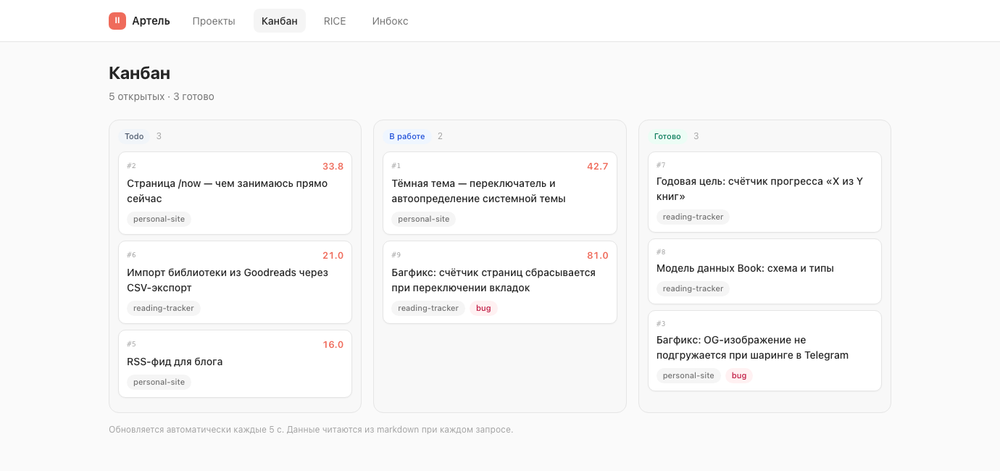
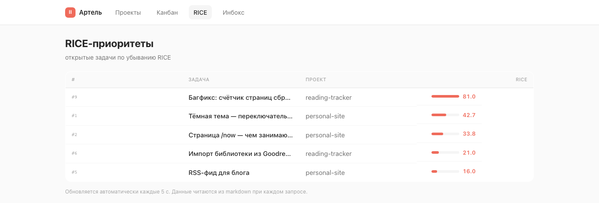

# Артель (`artelush`)

Фреймворк работы над проектами в паре с ИИ-командой ролей. Беклог-методология (RICE, инбокс, отслеживаемость) — её основа; сверху строятся роли, канон документации и тиринг моделей. Markdown-vault: человек читает в Obsidian, агент читает и **сам поддерживает** через встроенные навыки.

Идея: вы разговариваете с агентом о проектах — агент сам заводит задачи с приоритетами, обновляет статусы, разбирает инбокс. Файлы остаются простым markdown: никакого вендор-лока, всё видно глазами, всё в git.

## Это для вас, если

- вы ведёте **несколько проектов с ИИ-агентом** (Claude Code, Cursor, Codex…) и теряете контекст между сессиями;
- хотите **системность** — приоритеты, статусы, «что я вообще сделал» — но без Jira и без настройки;
- не хотите вендор-лока: данные должны оставаться **простыми файлами**, которые переживут любой инструмент;
- готовы, чтобы рутину беклога вёл агент, а вы — только подтверждали закрытие.

**Не для вас, если** нужен командный трекер с правами и спринтами, real-time-доской и интеграциями — это однопользовательский, файловый, агент-центричный подход.

## Как это выглядит

Локальный дашборд (`npm run dashboard`, Node 18+, без `npm install`) над тем же markdown-vault — те же файлы открываются и в Obsidian. Витрина **намеренно минимальная** (один файл, только чтение); подробнее — [dashboard/README.md](dashboard/README.md).

**Проекты** — карточки со статусом, приоритетом, прогрессом и топ-задачей по RICE:


**Канбан** — задачи всех проектов по статусам, с номером тикета, RICE и тегами:



**RICE-беклог** — всё, отсортированное по приоритету `(reach × impact × confidence%) / effort`:



**Инбокс** — сырые мысли «на потом»; агент по команде превращает их в задачи:


> Скриншоты сняты с демонстрационного vault. В шаблоне лежит один пример-проект под удаление.

## Сценарий: было → стало

**Было.** Идеи и задачи размазаны по заметкам, чатам с ИИ и голове. Новая сессия с агентом начинается с нуля — он не помнит, что вы делали вчера и почему. Приоритеты — на ощущение. «Что сделано за месяц?» — не ответить.

**Стало.** Один markdown-vault — общая память. Сессия начинается с «sync»: агент перечитывает проекты и задачи и сам предлагает, за что взяться по RICE. По ходу разговора заводит и двигает задачи, разбирает инбокс, фиксирует решения. Закрыть задачу может только ваш апрув — агент предъявляет, что сделал, и ждёт «ок». В конце недели «итоги» собираются из закрытых задач сами.

```
«посмотри что по задачам, бери запланированное в работу»
   → sync → берёт верхнюю по RICE → doing → делает → review → ждёт апрува
«разбери инбокс»   → 3 сырые записи → 3 задачи с RICE, инбокс пуст
«итоги недели»     → что сделано и зачем, по проектам
```

## Как включить методологию у своего агента

Канонические правила — в `AGENTS.md`, навыки — markdown-инструкции в `skills/*/SKILL.md`. Многие агенты (Cursor, Codex и др.) читают `AGENTS.md` сами; любому достаточно дать эту инструкцию в начале работы (кнопка копирования — в правом верхнем углу блока):

```text
Ты ведёшь мой проектный vault по методологии Артели. Сначала прочитай в корне
репозитория AGENTS.md и _rules.md — это твои правила. Навыки лежат в
skills/*/SKILL.md (sync, backlog, close, recap, inbox) — выполняй их по шагам, когда
применимы. Ключевое: каждое значимое действие отражай задачей и не отчитывайся
«готово», пока работа не отражена задачей и не проверена. Начни с sync — загрузи
контекст всех проектов и предложи, с чего начать.
```

Дальше он работает сам — скажите «sync» в любой момент, чтобы перечитал контекст. Файлы `SKILL.md` — обычный markdown, любая модель с доступом к файлам их исполнит.

> Рядом лежит `CLAUDE.md` с одной строкой `@AGENTS.md` — это шим для инструментов, которые не читают `AGENTS.md` сами, но поддерживают такой импорт. Можно игнорировать.

## Документация

**Начать**
- [Установка и настройка](docs/installation.md) — шаблон, клон, Obsidian, несколько устройств, встраивание в код-репо

**Методология**
- [Обзор](docs/methodology.md) — принципы, проекты, задачи, RICE, жизненный цикл, инбокс
- [Роли](docs/roles.md) — аналитик, разработчик, ревьюер, техписатель; включение по RICE
- [Жизненный цикл и гейты](docs/workflow.md) — пороги «RICE → роль», гейт «готово», релиз-гейт
- [Документация проекта](docs/doc-canon.md) — канон внешней/внутренней доки, карта APC
- [Стайлгайд](docs/styleguide.md) — APC, против ИИ-воды, формат под агента

**Справка**
- [Архитектура](docs/architecture.md) — из чего собран шаблон, роль каждой папки
- [Навыки](docs/skills.md) — sync / backlog / close / recap / inbox, как добавить свой
- [Справочник полей](docs/reference.md) — структура и все поля frontmatter
- [FAQ](docs/faq.md)
- [Changelog](CHANGELOG.md) — изменения методологии

**Инструменты**
- [Дашборд](dashboard/README.md) — локальная веб-витрина

## Установка

1. Нажмите **Use this template** (или склонируйте) → получите чистый vault.
2. Откройте папку в своём агенте и дайте ему инструкцию из раздела выше (Claude Code подхватит правила сам через `CLAUDE.md` → `AGENTS.md`).
3. (Опционально) Откройте папку как Obsidian-vault и поставьте плагин **Dataview** — заработают сводки `_dashboard.md` и `tasks.md`.
4. Удалите `projects/example-project/` и создайте свой первый проект (попросите агента: «заведи проект X»).

## Структура

```
AGENTS.md            ← канонические правила для агента (вендор-нейтрально)
CLAUDE.md            ← шим `@AGENTS.md` для Claude Code (он не читает AGENTS.md сам)
_rules.md            ← полная методология
_templates/          ← шаблоны задачи и проекта
_dashboard.md        ← Dataview-сводка по всем проектам
_inbox/              ← сырые мысли «на разбор» (по файлу на запись)
projects/
  <проект>/
    <проект>.md      ← карточка проекта: суть, статус, метрики, лог сессий
    roadmap.md       ← фазы и планы
    tasks/
      tasks.md       ← Dataview-индекс задач
      <задача>.md    ← задача с RICE-приоритетом и сквозным id
skills/
  sync/              ← загрузить контекст всех проектов в сессию
  backlog/           ← завести задачу с RICE и номером тикета
  close/             ← закрыть задачу (done + лог сессии) или завести постфактум
  recap/             ← итоги за период (день/неделя/месяц) для ревью и саморефлексии
  inbox/             ← разобрать _inbox/ в задачи
```

## Ключевые конвенции

- **RICE-приоритизация**: `(reach × impact × confidence%) / effort` — каждая задача оценена, беклог сортируется сам.
- **Сквозные id тикетов**: максимальный `id` по всем проектам + 1. Не переиспользуются.
- **Гейт отслеживаемости** (главное правило): агент не отчитывается о выполненной работе, пока она не отражена задачей (`doing`/`done`) — включая работу над самим инструментарием (дашборд, vault, скиллы). Нет задачи — заводит постфактум через `close`. По vault всегда можно восстановить, что и когда делалось.
- **Закрытие через `close`**: `done` ставится **только после подтверждения пользователя** — агент предъявляет, что сделано по тикету, и ждёт ок; затем строка в лог сессии.
- **Когда `doing` пуст** — агент предлагает 3 задачи: топ-3 по RICE, либо (если проектов ≥3) по одной из трёх разных проектов, чтобы фокус не сваливался в один.
- **Инбокс-цикл**: сырая мысль → `_inbox/*.md` → навык `inbox` превращает её в задачу и удаляет запись.
- **Задача без секции «План»**: «как делать» — кухня исполнителя; пользователю важны DoD (наблюдаемый результат) и прогресс по нему. План, если нужен, идёт в «Заметки».
- **Статусы**: `todo → doing → done` (+ `blocked`, `cancelled`).

## Два режима использования

- **Центральный vault** (рекомендуется): один репозиторий — память по всем вашим проектам. Код живёт в своих репо, контекст и задачи — здесь.
- **Встроенный**: скопируйте `_rules.md`, `_templates/` и `skills/` в существующий код-репозиторий и ведите `projects/<имя>/` рядом с кодом.

## Опционально

- **Git-синк**: сделайте vault приватным git-репо — агент коммитит и пушит изменения, история бесплатно.
- **Инбокс с телефона**: любой способ положить markdown-файл в `_inbox/` (веб-форма, Shortcuts, бот) — агент разберёт.

## Лицензия

MIT — берите, меняйте, делитесь.
