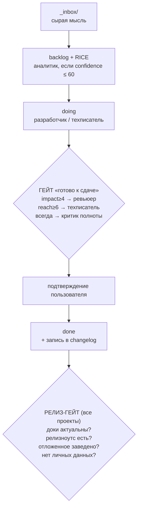

# Артель (`artelush`): ИИ-команда и каноничная документация (черновик)

> Имя фреймворка: **Артель** (кириллица — для людей) / **`artelush`** (латиница —
> репо, npm, GitHub-орг; в `-ush`-семье llmush/techdocush). Метафора: артель —
> объединение мастеров, работающих сообща и делящих труд по ролям (= `Collaboration`
> из APC). На 2026-06-13 `npm artelush` и `github.com/artelush` свободны.

> Статус: дизайн утверждён 2026-06-13, идёт реализация (#186). Распиливается на
> `docs/workflow.md`, `docs/roles.md`, `docs/doc-canon.md`, `docs/styleguide.md`
> и шаблоны в `_templates/`. На старте — 4 роли (ревьюер совмещён с критиком полноты).

## 1. Зачем

Сейчас качество работы держится на том, что пользователь напоминает: завести
задачу, проверить документацию перед релизом, вести релизноутс. Цель — снять это
с пользователя: **команда ролей включается сама, соразмерно важности задачи**, и
ловит то, о чём пользователь мог не подумать.

Не цель: бюрократия и документация ради документации. Любой ритуал, который не
помогает конкретному адресату, из методологии исключается.

**Стратегический мотив — вендор-устойчивость.** Зависимость от одной топ-модели —
бизнес-риск (бан, недоступность, цена). Артель снижает его двумя механизмами:
вендор-нейтральная дока (`AGENTS.md` — любой агент въезжает) и тиринг моделей
(раздел 4.1). Чем лучше документация, тем больше работы выполнимо на дешёвой или
локальной модели — проект переживёт отказ любого конкретного вендора.

## 2. Осевой принцип — APC (Audience · Purpose · Collaboration)

Ядро методологии документации — авторский фреймворк техкоммуникации **APC**
(преподаётся ученикам). Любой документ определяется тремя вопросами:

- **Audience** — в какой **роли** читатель в момент чтения (потребляет продукт /
  развивает проект / агент), а **не его должность**. Один человек носит разные
  роли: разработчик читает API-reference как потребитель, а архитектуру — как
  контрибьютор; автор завтра — пользователь собственного quickstart.
- **Purpose** — какое решение/действие документ разблокирует? Удобно формулировать
  как **JTBD** («когда я …, хочу …, чтобы …»); может быть списком работ.
- **Collaboration** — техпис не знает всё и не должен; знание собирается из
  **источников по приоритету**: (1) существующие артефакты проекта — ТЗ, заметки
  встреч, тикеты, переписки, старые доки, дизайны; (2) код; (3) люди-SME (интервью)
  — последними, только для пробелов и противоречий. Человека берегут: спрашивают то,
  чего нет в зафиксированном.

**Тест ценности документа = APC:** нет ясных Audience и Purpose — документ не
пишется (гейт против «доки ради доки»). Есть — техпис определяет Collaboration и
оформляет. Применяют техписатель (вход) и критик полноты (выход).

Три адресата (измерение Audience):

| Audience (роль в момент чтения) | Доку получает | Purpose |
|---|---|---|
| Потребитель продукта — обыватель, разработчик или сам автор | внешняя (quickstart, руководство/API-reference, changelog) | использовать продукт и решить, подходит ли |
| Контрибьютор проекта — разработчик-человек или агент | внутренняя (`AGENTS.md`, архитектура, решения) | понять и менять проект — без вендор-лока, без объяснений заново |
| Адоптер фреймворка | методология Артели | выбрать нас |

Audience определяется ролью, не должностью: для библиотеки/API/dev-инструмента
потребители — разработчики, и внешняя дока техническая (API-reference, SDK) — но
это всё ещё внешняя, потому что её Audience *использует продукт*, а не развивает проект.

Следствие для внутренней доки (Audience = агент): она пишется **под машинное
потребление** — открытый `AGENTS.md`-формат, структурно, кратко. Контракт проекта
для любого агента: вендор-независимость и экономия токенов.

APC — слой «что и с кем». Он дополняется процессным слоем (RICE-гейты — *когда*
дока обязательна, раздел 4–5) и стайлгайдом (*как* писать, раздел 7). Слои не
пересекаются.

## 3. Роли

Все роли — это субагенты (изолированный контекст + свой системный промпт).
Включаются автоматически по порогам RICE, не по памяти ассистента.

| Роль | Когда включается | Что делает |
|---|---|---|
| **Аналитик** | до старта, если `confidence ≤ 60` | «ту ли задачу решаем, что неизвестно» — правит формулировку и DoD до кода |
| **Разработчик** | всегда (основной исполнитель) | реализация; **источник фактов (SME)** для внутренней доки — что в архитектуре, какие решения |
| **Ревьюер** (на старте совмещён с критиком полноты) | всегда перед «готово» для значимой задачи; углубляется при `impact ≥ 4` | корректность и качество (баги, безопасность) **+ полнота**: чего не хватает, что не проверено, какой документ устарел |
| **Техписатель** | внешняя дока — `reach ≥ 6`; внутренняя дока — при значимом изменении архитектуры/контракта (любой reach) | **владелец всей документации** (внешней и внутренней): какая дока нужна, для кого, с какой целью; структура по Diátaxis; шаблоны; стайлгайд; in-product тексты. Содержание внутренней доки берёт у разработчика/аналитика как SME |
Ревьюер вправе поднять церемонию, если по ходу вскрылась низкая уверенность,
которой не было в исходной оценке. Отдельная роль «критик полноты» зарезервирована:
если на практике совмещённый ревьюер начнёт упускать полноту в пользу багов — выделить обратно.

## 4. Пороги: компонент RICE → роль

Не итоговый RICE-скор (Effort в знаменателе искажает риск), а **компоненты по
отдельности**. Пороги привязаны к якорям калибровки из навыка `backlog`.

| Компонент | Шкала | Порог включения | Кого будит |
|---|---|---|---|
| reach | 1–10 | ≥ 6 (частый/ежедневный сценарий) | техписатель → внешняя дока |
| impact | 1–5 | ≥ 4 (сильно двигает метрику / критично) | ревьюер углубляется (баги, безопасность) |
| confidence | 50–100 | ≤ 60 (гипотеза, мало данных) | аналитик |
| effort | sp/5 (= rice_effort) | sp ≥ 8 → декомпозиция, параллельные субагенты |
| — | — | изменилась архитектура/контракт проекта | техписатель → внутренняя дока (источник — разработчик) |
| — | — | всегда (значимая задача) | ревьюер (корректность + полнота) |

Активные роли вычисляются при заведении задачи и пишутся в frontmatter:
`roles: [reviewer, techwriter]`. Дашборд показывает выведенный состав, а не ручную метку.

Задача без RICE (спонтанная работа, мета/инфра) → минимальный гейт: ревьюер
(корректность + полнота), не более.

### 4.1 Тиринг моделей: документация как рычаг независимости

Зависимость от одной топ-модели — точка отказа. Артель назначает задаче **tier
модели** и по умолчанию работает на самой дешёвой, что справится.

Tier выводится из **природы задачи, не из RICE-важности** (это разные оси: важная
задача бывает механической, неважная — требующей ума):

| Tier | Когда | Примеры |
|---|---|---|
| **дешёвая / локальная** (дефолт) | механическое, шаблонное, чёткий DoD + полный `AGENTS.md` | рутинная реализация, бойлерплейт, миграции по образцу |
| **топ** | низкий `confidence` (≤60, неоднозначность), роль аналитика, сложный ревью корректности | постановка мутной задачи, архитектурное решение |

Принцип «дёшево, но не любой ценой» — **эскалация**: дешёвая модель берётся по
умолчанию; при затыке или низкой уверенности в результате задача поднимается на топ.

Документация — рычаг: дока замещает *контекстный* интеллект (догадаться про
проект), но не *рассуждательный* (сложная логика). Поэтому чем полнее дока, тем
больше задач падает в дешёвый tier. Метрика проекта — **% задач на дешёвой
модели**; растёт по мере улучшения документации и прямо измеряет вендор-независимость.

## 5. Жизненный цикл задачи и гейты

Гейт «готово» — часть DoD: задача не уходит в `done`, пока активные роли не
отработали и нужная дока не актуальна.

**Релиз-гейт — для всех проектов**, но «релиз» определяется по типу проекта:
- продукт (bukvalno) → деплой в прод;
- инструмент / библиотека → публикация пакета или тег версии;
- шаблон (artelush) / внутренний инструмент (dashboard) → мерж в основную ветку.

Смысл один: момент, когда изменение становится доступно потребителю — тогда доки и
релизноутс обязаны быть актуальны.

## 6. Канон документации проекта

Лаконично, но обязательно. Состав зависит от `status` проекта — не требуем
runbook с проекта-идеи.

**Внешняя (Audience: потребитель продукта — любой квалификации, включая
разработчиков для dev-инструментов и самого автора)** — владелец техписатель:

| Документ | Когда обязателен |
|---|---|
| README / quickstart | всегда |
| Руководство пользователя | в проде |
| CHANGELOG / релизноутс | при первом релизе, далее ведётся через `close` |

**Внутренняя (Audience: контрибьютор проекта — разработчик-человек или агент)** — владелец техписатель, источник содержания — разработчик (SME):

| Документ | Когда обязателен |
|---|---|
| `AGENTS.md` (контракт проекта для агента) | всегда |
| Архитектура (стек, модули, потоки) | всегда |
| Запуск и деплой | разработка+ |
| Решения (ADR-lite) | по мере роста |
| Runbook (как чинить в проде) | в проде |

Документация ведётся **инкрементально через гейты**: значимое изменение → нужный
документ обновляется как часть DoD. Долг не копится.

Место: документация проекта — в репо проекта (`docs/`). Карточка проекта в vault
получает ссылку и поле «полнота документации под текущий статус».

### 6.1 Карта типов доки (авторская таксономия)

Карта — прямая операционализация APC (раздел 2): `Audience × Purpose → документ`,
`Collaboration → у кого техпис добывает знание`. Diátaxis организует типы по
«учусь/делаю» для человека; мы — по «кто читает и какое решение принимает», и
включаем агента как равноправного читателя.

| Audience | Purpose (решение/действие) | Документ | Collaboration (SME) |
|---|---|---|---|
| Пользователь | начать, получить быстрый успех | quickstart | разработчик |
| Пользователь | достичь конкретной цели | руководство / how-to | разработчик |
| Пользователь | понять, подходит ли продукт | обзор «зачем это» | аналитик / владелец (видение) |
| Пользователь | узнать, что изменилось | changelog | разработчик + навык `close` |
| Агент | как здесь работать (правила, команды) | `AGENTS.md` — контракт проекта | разработчик |
| Агент | как система устроена | карта архитектуры | разработчик |
| Агент | почему так решили | решения (ADR-lite) | аналитик + разработчик |
| Агент | как починить в проде | runbook | разработчик |

Авторский вклад: таксономия, где агент — первоклассный читатель, тип документа
выводится из Purpose, а наполнение — из Collaboration с SME. Этого нет ни в
Diátaxis, ни в Google/Microsoft style guides.

### 6.2 Онбординг существующего проекта (bootstrap по артефактам)

Частый кейс: проект уже есть, человек переходит на Артель, документации нет или
она кривая. Режим `onboard` собирает первичный канон **из всего, что уже
зафиксировано**, и бережёт время владельца. Источники по приоритету (Collaboration
из APC):

| Источник | Что даёт | Где берётся |
|---|---|---|
| **Артефакты проекта** | Purpose, Audience, требования, решения и *почему* | ТЗ, заметки встреч, тикеты, переписки, старые доки, дизайны |
| **Код** | стек, структура, точки входа, API, команды запуска | репозиторий → архитектура, `AGENTS.md`, reference |
| **Человек (SME)** | то, чего нет в артефактах и коде; разрешение противоречий | интервью владельца — **последним** |

Принцип: агент максимально извлекает из зафиксированного (артефакты → код),
сгенерированное помечает «черновик, проверь» (гейт «как проверено» из `_rules`), и
зовёт человека только для пробелов и противоречий — галлюцинация не выдаётся за
истину. Разработчик-агент читает код, аналитик — артефакты и интервью, техписатель
собирает и оформляет.

Стратегическая ценность: прямой ответ боли ЦА автора (techdocush — «компаниям
нужна документация, не знают с чего начать»). Заходит в легаси без доки и поднимает
канон из того, что у команды уже есть. Прообраз — проект автора **mielofon**.

## 7. Стайлгайд

Собирается из готового, ужимается до лаконичного:

Живёт **отдельным документом** `docs/styleguide.md` (канон Артели, переносится в
проекты). Проект может иметь тонкий оверрайд (термины, голос бренда), не дублируя канон.

- **Авторская карта типов доки** — ось `адресат × решение/действие` (см. раздел 6.1). Выведена из осевого принципа (раздел 2), не заимствована.
- **Prior art** — [Diátaxis](https://diataxis.fr/) (берём принцип «не смешивать типы под разные потребности», но рамку строим свою и расширяем на агента-читателя, которого у Diátaxis нет); база правил — Google / Microsoft style guide, сжать.
- **Наше: правила против ИИ-воды** — запрет на «в этой статье мы рассмотрим», маркетинговый пух, повторы, преамбулы. Документ = решение/действие адресата, не текст ради объёма.
- **Формат под агента** — внутренняя дока в открытом `AGENTS.md`-стиле, машиночитаемо.

## 8. Что готовое, что наше

| Кирпич | Источник |
|---|---|
| Системный промпт техписателя | допилить из [VoltAgent technical-writer](https://github.com/VoltAgent/awesome-claude-code-subagents/blob/main/categories/08-business-product/technical-writer.md) |
| База стайлгайда | Google / Microsoft (сжать) |
| Принцип «не смешивать типы доки» | Diátaxis (prior art, не наследуем рамку) |
| **Карта типов доки `адресат × решение`, агент как читатель** | наше |
| **Привязка доки к RICE и стадии проекта** | наше |
| **Гейты: дока как обязательный DoD** | наше |
| **Стайлгайд против ИИ-воды + формат под агента** | наше |
| **Канон + шаблоны в переносимом репо** | наше |

Фишка фреймворка: никто не связал документацию с приоритизацией задач и
автогейтами, и не оптимизировал внутреннюю доку под вендор-независимое потребление
агентом. Артель — методология, где дока ведётся сама, соразмерно важности.

## 9. Решения и открытые вопросы

Решено (2026-06-13):
- Релиз-гейт — для **всех** проектов; «релиз» определяется по типу проекта (раздел 5).
- Стайлгайд — **отдельный** документ `docs/styleguide.md` (раздел 7).
- Имя — **Артель** / `artelush` (раздел 1).

Открыто:
- Состав ролей — пять достаточно, или какую-то убрать на старте?
- Минимальный набор шаблонов `_templates/docs/` — обсуждается (кандидат: README, architecture, AGENTS.md, CHANGELOG; шапка каждого = APC).
- Режим `onboard` (раздел 6.2) — в v1 или после базовой методологии?
