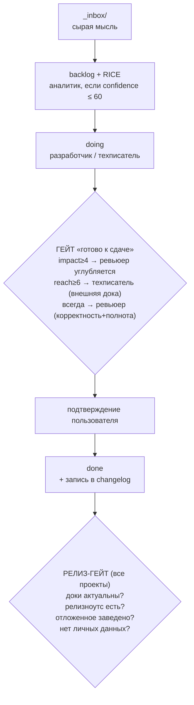

<!-- Audience: агент или контрибьютор Артели, ведущий задачу от постановки до закрытия
     Purpose: знать пороги включения ролей, гейт «готово» и релиз-гейт, чтобы не пропустить обязательные шаги -->

# Жизненный цикл задачи и гейты

В Артели роли и проверки **включаются автоматически по важности задачи** — это
снимает с человека необходимость напоминать. Пороги привязаны к компонентам RICE
(якоря калибровки — в навыке `backlog`).

## Жизненный цикл

### Вход в работу: `doing` до старта, не после

**Канон:** перевести задачу в `doing` нужно **перед** тем, как брать её в работу, а не по завершении.

Почему это важно:
- Доска «В работе» строится по полю `status:` в git — без раннего `doing` реальная работа невидима на борде.
- Per-task effort (токены, грейд) не копится, если задача не прошла через `doing` до закрытия.

Паттерн-нарушение: прыжок `todo → review` (или сразу в `done`) в обход `doing`. Именно это скрывает прогресс и разрушает учёт.

> **Адаптер-специфика.** Конкретный способ *фиксировать* стоимость и *механически блокировать* прыжок — дело адаптера (напр., Claude-адаптер llmush делает это через `scripts/task-checkpoint.py` + pre-commit-хук; этот скрипт — в llmush-vault, **не в шаблоне Артели**). Канон Артели — только маркер `doing`: он существует, он ставится до старта, он виден на борде.

## Пороги: компонент RICE → роль

Не итоговый RICE-скор (Effort в знаменателе искажает риск), а **компоненты по
отдельности**.

| Компонент | Порог | Кого включает |
|---|---|---|
| reach ≥ 6 | частый/ежедневный сценарий | техписатель → внешняя дока |
| impact ≥ 4 | сильно двигает метрику / критично | ревьюер углубляется (баги, безопасность) |
| confidence ≤ 60 | гипотеза, мало данных | аналитик (до старта) |
| sp ≥ 8 | крупная/неопределённая | декомпозиция, параллельные субагенты |
| изменилась архитектура/контракт | любой reach | техписатель → внутренняя дока |
| всегда (значимая задача) | — | ревьюер (корректность + полнота) |

Роли пишутся в `roles:` frontmatter задачи (см. [roles.md](roles.md)). Грейд модели
(`model_tier`) назначается **отдельно, по природе задачи, не по важности** — три
грейда `junior/middle/senior` с эскалацией; см. [Тиринг моделей](methodology.md#тиринг-моделей).

## Гейт «готово к сдаче»

Часть DoD: задача не уходит в `done`, пока активные роли не отработали и нужная
дока не актуальна. Ревьюер вправе вернуть задачу, если вскрылась низкая
уверенность, которой не было в исходной оценке.

## Релиз-гейт — для всех проектов

«Релиз» определяется по типу проекта:

- продукт → деплой в прод;
- инструмент / библиотека → публикация пакета или тег версии;
- шаблон / внутренний инструмент → мерж в основную ветку.

Смысл один: момент, когда изменение становится доступно потребителю — тогда доки и
релизноутс обязаны быть актуальны, отложенное заведено задачами, в конфигах нет
личных данных.

### Перед деплоем — прочитай runbook, не гадай

Агент **обязан знать, как проект деплоится, из его документации** (`docs/` или
`deploy/` проекта, runbook), а не реверс-инжинирить процесс на месте. Правило:

- Перед деплоем/релизом — прочитай runbook проекта. Не уверен, где он — это сигнал, что **runbook отсутствует или неполон**: сначала задокументируй процесс, потом деплой.
- **Дока обязана соответствовать реальности.** Если README обещает «CI/CD работает», а деплой не настроен (workflow не в репо, секреты не заданы) — это хуже, чем отсутствие доки: она вводит в заблуждение. Расхождение дока↔реальность — блокер релиза.
- Деплой-конфиг (CI-workflow, манифесты сервиса) живёт **в репозитории**, а не в локальном игноре (`.git/info/exclude`/`.gitignore`) — иначе он не работает и об этом никто не знает.
